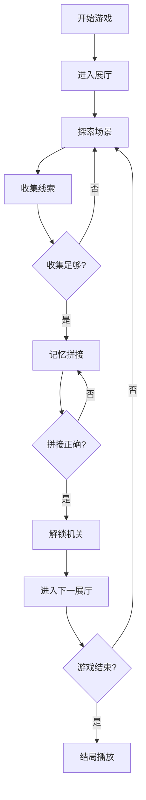

## 1. 产品概述

《琥珀记忆馆》是一款基于 Web 的 H5 叙事解谜游戏，玩家在一座封存着珍贵记忆的神秘博物馆中探索，通过收集线索、拼接记忆碎片、解开古老机关来逐步揭开被遗忘的故事。

- 目标用户：喜欢叙事解谜、轻度探索类游戏的玩家
- 核心价值：沉浸式的故事体验 + 精巧的解谜玩法 + 琥珀主题的艺术风格

## 2. 核心功能

### 2.1 用户角色

| 角色 | 参与方式 | 核心权限 |
|------|---------|---------|
| 玩家 | 直接进入游戏 | 探索展厅、收集线索、解谜、推进剧情 |

### 2.2 功能模块

1. **展厅漫游**：玩家可在博物馆的多个展厅之间自由移动，探索不同场景
2. **线索收集**：在场景中发现并收集各类物品和信息碎片
3. **记忆拼接**：将收集到的记忆碎片按正确顺序排列，还原完整故事
4. **机关交互**：通过破解谜题、输入密码等方式开启隐藏区域
5. **章节推进**：完成当前章节目标后解锁下一章节内容
6. **音效控制**：背景音乐和音效的开关与音量调节

### 2.3 页面详情

| 页面名称 | 模块名称 | 功能描述 |
|---------|---------|---------|
| 开始页面 | 标题模块 | 游戏标题、开始按钮、音效开关 |
| 游戏主界面 | 展厅漫游 | 2D 场景渲染、角色移动、场景切换 |
| 游戏主界面 | 线索收集 | 物品拾取、物品栏展示、线索查看 |
| 游戏主界面 | 记忆拼接 | 碎片拖拽、拼图验证、剧情播放 |
| 游戏主界面 | 机关交互 | 密码输入、机关动画、奖励发放 |
| 游戏主界面 | 章节推进 | 目标提示、进度显示、章节切换 |
| 设置面板 | 音效控制 | 音量滑块、静音按钮 |

## 3. 核心流程

玩家从开始界面进入游戏，首先出现在博物馆大厅。通过点击场景中的可交互区域探索环境，收集散落的线索物品。当收集到足够的记忆碎片后，进入记忆拼接界面，将碎片按正确顺序排列以还原一段记忆。解开特定机关后，解锁新的展厅区域，推进到下一章节。重复此流程直至通关。

## 4. 用户界面设计

### 4.1 设计风格

- **主色调**：琥珀金 (#D4AF37)、深棕 (#3E2723)、暖橙 (#FF8A65)
- **辅助色**：深紫 (#4A148C)、古铜 (#8D6E63)
- **按钮风格**：圆角矩形、琥珀色边框、微浮雕效果、悬停发光
- **字体**：标题使用 "ZCOOL XiaoWei"（艺术感衬线字体），正文使用 "Noto Serif SC"（优雅宋体）
- **布局风格**：场景占满屏幕，UI 元素半透明浮动于边缘
- **整体氛围**：神秘、复古、温暖、富有故事感

### 4.2 页面设计概述

| 页面名称 | 模块名称 | UI 元素 |
|---------|---------|---------|
| 开始页面 | 标题模块 | 琥珀色渐变背景、金色标题文字、浮动的琥珀装饰、开始按钮、设置图标 |
| 游戏主界面 | 展厅漫游 | 2D 手绘风格场景、可交互热点高亮、转场动画 |
| 游戏主界面 | 线索收集 | 物品栏（底部抽屉式）、拾取动画、线索详情弹窗 |
| 游戏主界面 | 记忆拼接 | 碎片网格、拖拽区域、验证按钮、成功时的光效 |
| 游戏主界面 | 机关交互 | 密码盘、数字键盘、机关转动动画 |
| 游戏主界面 | 章节推进 | 左上角进度条、目标提示卡片、章节标题淡入 |
| 设置面板 | 音效控制 | 滑动条、开关按钮、半透明毛玻璃背景 |

### 4.3 响应式

- 采用移动优先设计，主要适配手机竖屏（375x667 ~ 430x932）
- 支持平板和桌面端等比缩放
- 触摸操作优化：按钮最小 44x44px，拖拽区域足够大
- 虚拟键盘适配，输入时自动上推页面

### 4.4 2D 场景设计

- **环境氛围**：暖色调为主，琥珀色光晕效果，粒子尘埃漂浮
- **灯光设置**：顶光模拟博物馆射灯，局部聚光突出可交互物体
- **镜头设置**：固定视角，支持横向滚动查看大场景
- **构图元素**：对称式展厅布局，中心视觉焦点，琥珀展品点缀
- **交互动画**：热点呼吸闪烁、悬停放大、点击波纹反馈
- **后处理效果**：轻微的复古胶片颗粒，琥珀色滤镜叠加
- **性能控制**：单场景精灵数量控制在 50 以内，纹理大小 ≤ 1024x1024
