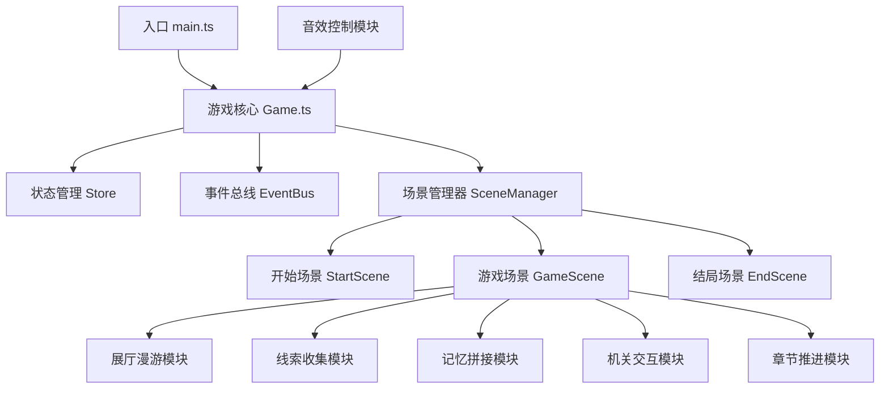

## 1. 架构设计

本项目为纯前端 H5 游戏，采用模块化架构设计，以 PixiJS 为渲染核心，各游戏模块独立实现，通过事件总线和状态管理进行通信。



## 2. 技术描述

- **前端框架**：Vite 5.x + TypeScript 5.x
- **渲染引擎**：PixiJS 7.x（2D  WebGL 渲染）
- **状态管理**：自研轻量级 Store（基于发布订阅模式）
- **事件系统**：全局 EventBus（事件总线）
- **音频系统**：Web Audio API + Howler.js
- **样式方案**：原生 CSS + CSS 变量
- **初始化工具**：Vite 官方 vanilla-ts 模板

## 3. 目录结构

```
src/
├── main.ts                 # 应用入口
├── game/
│   ├── Game.ts             # 游戏核心类
│   ├── Store.ts            # 全局状态管理
│   ├── EventBus.ts         # 事件总线
│   ├── types.ts            # 类型定义
│   ├── config.ts           # 游戏配置
│   └── data/
│       ├── chapters.ts     # 章节数据
│       ├── clues.ts        # 线索数据
│       └── puzzles.ts      # 谜题数据
├── scenes/
│   ├── Scene.ts            # 场景基类
│   ├── StartScene.ts       # 开始场景
│   ├── GameScene.ts        # 游戏主场景
│   └── EndScene.ts         # 结局场景
├── modules/
│   ├── ExhibitionModule.ts  # 展厅漫游模块
│   ├── ClueModule.ts        # 线索收集模块
│   ├── MemoryModule.ts      # 记忆拼接模块
│   ├── MechanismModule.ts   # 机关交互模块
│   ├── ChapterModule.ts     # 章节推进模块
│   └── AudioModule.ts       # 音效控制模块
├── ui/
│   ├── UIComponent.ts       # UI 组件基类
│   ├── InventoryUI.ts       # 物品栏 UI
│   ├── DialogUI.ts          # 对话框 UI
│   ├── MemoryPuzzleUI.ts    # 记忆拼图 UI
│   ├── LockUI.ts            # 密码锁 UI
│   └── SettingsUI.ts        # 设置 UI
├── utils/
│   ├── AssetLoader.ts       # 资源加载器
│   ├── Animator.ts          # 动画工具
│   ├── Renderer.ts          # 渲染辅助
│   └── Storage.ts           # 本地存储
└── assets/
    ├── images/              # 图片资源
    ├── audio/               # 音频资源
    └── fonts/               # 字体资源
```

## 4. 模块职责定义

### 4.1 核心类

| 类名 | 职责 |
|------|-----|
| Game | 游戏主循环、场景切换、模块调度 |
| Store | 游戏状态存储（收集物品、章节进度、设置等） |
| EventBus | 全局事件分发与监听 |
| SceneManager | 场景的创建、销毁、切换 |

### 4.2 游戏模块

| 模块 | 核心职责 |
|------|---------|
| ExhibitionModule | 展厅场景渲染、热点管理、场景切换、相机控制 |
| ClueModule | 线索拾取、物品栏管理、线索详情查看 |
| MemoryModule | 记忆碎片展示、拖拽排序、正确性验证 |
| MechanismModule | 机关渲染、密码输入、解锁逻辑、动画效果 |
| ChapterModule | 章节数据管理、进度追踪、目标判定、章节切换 |
| AudioModule | BGM 播放、音效播放、音量控制、静音管理 |

### 4.3 UI 组件

| 组件 | 职责 |
|------|-----|
| InventoryUI | 底部物品栏展示、物品选中、详情弹窗 |
| DialogUI | 剧情对话、旁白文字、逐字显示动画 |
| MemoryPuzzleUI | 记忆拼接游戏界面、碎片拖拽、验证反馈 |
| LockUI | 密码锁界面、数字键盘、开锁动画 |
| SettingsUI | 设置面板、音量调节、音效开关 |

## 5. 核心数据模型

### 5.1 类型定义

```typescript
// 线索物品
interface Clue {
  id: string;
  name: string;
  description: string;
  image: string;
  chapterId: string;
  isMemory: boolean;  // 是否为记忆碎片
  memoryOrder?: number;  // 记忆碎片的正确顺序
}

// 展厅
interface Exhibition {
  id: string;
  name: string;
  background: string;
  hotspots: Hotspot[];
  unlocked: boolean;
}

// 交互热点
interface Hotspot {
  id: string;
  x: number;
  y: number;
  width: number;
  height: number;
  type: 'clue' | 'mechanism' | 'exit';
  targetId: string;
  hint: string;
}

// 机关
interface Mechanism {
  id: string;
  type: 'password' | 'sequence';
  answer: string | number[];
  reward: string;  // 解锁的展厅或线索 ID
  hint: string;
}

// 章节
interface Chapter {
  id: string;
  title: string;
  description: string;
  exhibitions: string[];
  requiredClues: string[];
  storyText: string;
}

// 游戏状态
interface GameState {
  currentChapter: string;
  currentExhibition: string;
  collectedClues: string[];
  solvedMechanisms: string[];
  unlockedExhibitions: string[];
  settings: GameSettings;
}

// 设置
interface GameSettings {
  bgmVolume: number;
  sfxVolume: number;
  bgmMuted: boolean;
  sfxMuted: boolean;
}
```

### 5.2 事件定义

| 事件名 | 负载 | 触发时机 |
|--------|------|---------|
| clue:collect | { clueId: string } | 收集线索时 |
| clue:view | { clueId: string } | 查看线索详情时 |
| memory:start | { fragments: Clue[] } | 开始记忆拼接时 |
| memory:complete | { success: boolean } | 记忆拼接完成时 |
| mechanism:open | { mechanismId: string } | 打开机关时 |
| mechanism:solve | { mechanismId: string } | 机关解开时 |
| chapter:enter | { chapterId: string } | 进入章节时 |
| chapter:complete | { chapterId: string } | 章节完成时 |
| exhibition:enter | { exhibitionId: string } | 进入展厅时 |
| audio:play | { type: 'bgm'|'sfx', name: string } | 播放音频时 |
| settings:update | { settings: GameSettings } | 设置更新时 |
